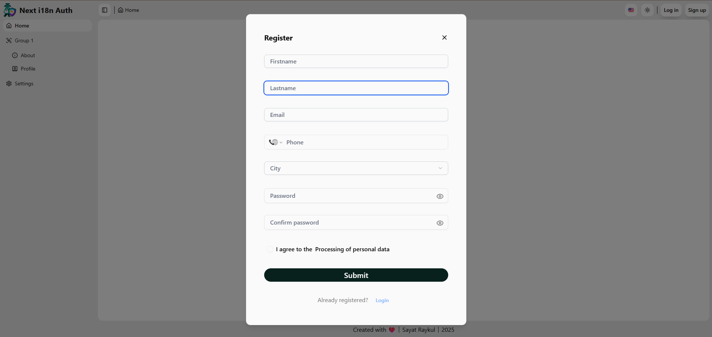
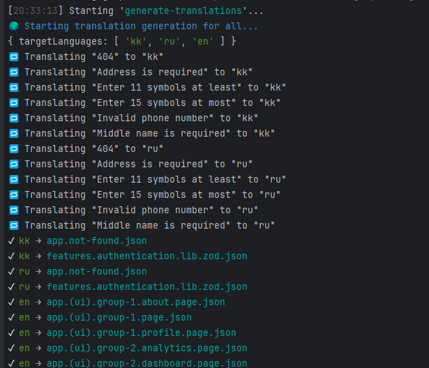

# Next i18n Auth Boilerplate

> A complete, production-grade Next.js starter with internationalization, authentication, UI components, testing, and more.
>
> * Are you tired of manually managing translation files in your projects?  
> * Do you want to streamline your internationalization workflow with fully automated tooling?  
> * Are you looking for a robust, scalable architecture that combines authentication, localization, theming, and type safety — all in one place?  
> * Would you benefit from a modern stack with built-in support for testing, reusable UI components, and strict typing from end to end?  
> * Do you want to future-proof your application with a maintainable and extensible codebase?
>
> If so, this boilerplate is for you. Fork it, customize it, and accelerate your development with a solid foundation that eliminates repetitive work and allows you to focus on what really matters — building great products.

---

[](https://next-i18n-auth.vercel.app/)
[](LICENSE)
[](https://nextjs.org/)
[](https://github.com/Sayyat/next-i18n-auth/stargazers)
[](https://github.com/Sayyat/next-i18n-auth/network/members)
[](https://github.com/Sayyat/next-i18n-auth/issues)
[](https://github.com/Sayyat/next-i18n-auth/commits/main)

---

## 🔥 Preview



## Deployment

This project is live and deployed on **Vercel**!
Visit the live demo: **[Next i18n Auth Boilerplate Live](https://next-i18n-auth.vercel.app/)**

## Features

* ⚡️ **Next.js 15**: Fast and scalable React framework with App Router.
* 🌍 **i18next**: Internationalization (i18n) with fully [automated](./docs/automation.md) typed translations.
* 🔒 **Next-Auth v5**: Authentication with JWT, OAuth, and social providers.
* 🎨 **shadcn/ui**: Beautiful accessible components with Tailwind CSS.
* 🛡️ **Zod**: End-to-end type-safe validation.
* 🚀 **TypeScript**: 100% typed full-stack application.
* 🌓 **Dark Mode**: Light/dark mode with system preference.
* 📈 **React Query**: Powerful data fetching and caching.
* 🧪 **Vitest & Playwright**: Full testing stack (unit, integration, e2e).

---

## Quick Start

### Prerequisites

Make sure you have the following installed:

* Node.js >= 18.x
* Yarn (preferred) or npm
* Git

### Installation

1. Clone the repository:

   ```bash
   git clone https://github.com/Sayyat/next-i18n-auth.git
   cd next-i18n-auth
   ```

2. Install dependencies:

   ```bash
   yarn install
   ```

3. Create a `.env` file in the root directory and add the following environment variables:

   ```env
   AUTH_URL=http://127.0.0.1:3001
   AUTH_SECRET=<Your Auth Secret>
   NEXT_PUBLIC_API_URL=<Your API URL>
   API_URL=<Your API URL>
   NODE_ENV=development
   NEXT_TELEMETRY_DISABLED=1
   RAPIDAPI_KEY=<Your RapidAPI key>
   ```

4. Start the development server:

   ```bash
   yarn dev
   ```

   The application will be available at `http://localhost:3000`.

---

## File Structure

You can find the file structure of the project in the [File Structure](./docs/file-structure.md) document.

---

## How to Use

### Authentication

* **Sign Up**: Use the `register` modal to create a new account. The backend API handles user registration and returns
  access and refresh tokens.
* **Log In**: Use the `login` modal to authenticate users. Tokens are stored securely, and JWT is decoded for user
  details.

### Localization
* The project uses `i18next` for localization. See [i18next](https://www.i18next.com/) for more details.
* The localization process is fully automated. See [Automation](./docs/automation.md) for more details.

* Full autocomplete for namespaces and translation keys thanks to auto type generation

* Supported languages: `Kazakh`, `English`, and `Russian`.
* Language can be changed using the dropdown in the header.


### Toast Notifications

* Feedback is provided using `react-toastify`.
* Example: Error messages during authentication or form validation feedback.

### Zod Validation

* Zod is used for client-side schema validation for forms.
* Errors are displayed with translations based on the current locale.

---

## Customization

### Add New Languages

1. **Add the new language key in `i18n/lib/config.ts`:**
   To add French (`fr`), update the `languages` array as follows:

   ```typescript
   export const languages = ["kk", "ru", "en", "fr"] as const;
   ```

2. **Generate language files for the new locale:**
   Run `gulp` or `yarn g` command to generate the template language files for the newly added language (`fr` in this
   case).

3. **Translate the new language files:**
   To translate the language files using RapidAPI, run the following command:

   ```bash
   gulp generate-translations -l fr
   ```

   Or use the alias:

   ```bash
   yarn g:trs -l fr
   ```

   That's it! Your new language should now be added to the system.
> **Note:** See [Automation](./docs/automation.md) for more details..

### Add New Pages

1. Create a new folder under the `app` directory, e.g., `app/dashboard`.
2. Add a new `page.tsx` file inside the folder.
3. Use the existing components for layout and styles.

---

## 📚 Tech Stack

| Technology                                                      | Description                                           |
|-----------------------------------------------------------------|-------------------------------------------------------|
| **[Next.js](https://nextjs.org/)**                              | React framework with server-side rendering            |
| **[Next-Auth](https://authjs.dev/)**                            | Authentication system for Next.js apps                |
| **[i18next](https://www.i18next.com/)**                         | Localization and translation management               |
| **[gulp](https://gulpjs.com/)**                                 | A toolkit to automate & enhance your workflow         |
| **[Tailwind CSS](https://tailwindcss.com/)**                    | Utility-first CSS framework                           |
| **[shadcn/ui](https://ui.shadcn.com/)**                         | Beautiful prebuilt components                         |
| **[TypeScript](https://www.typescriptlang.org/)**               | Static typing for scalable applications               |
| **[Zod](https://zod.dev/)**                                     | Type-safe schema validation                           |
| **[@tanstack/react-query](https://tanstack.com/query/latest)**  | Powerful data fetching library                        |
| **[Vitest](https://vitest.dev/)**                               | Fast unit testing framework                           |
| **[Playwright](https://playwright.dev/)**                       | End-to-end browser testing framework                  |
| **[@t3-oss/env-nextjs](https://github.com/t3-oss/t3-env)**      | Type-safe environment variable management for Next.js |
| **[React-Toastify](https://fkhadra.github.io/react-toastify/)** | Toast notifications                                   |

---

## 🚀 Running Tests

This project includes a robust testing setup to ensure code quality and application reliability. Below are the details
for running different types of tests:

### 1. **Unit and Integration Tests**

We use **Vitest** with **React Testing Library** to write and run unit and integration tests.

#### Run Unit/Integration Tests:

```bash
  yarn test
```

#### Watch Tests:

```bash
  yarn test:watch
```

#### Coverage Report:

```bash
   yarn coverage
```

---

### 2. **End-to-End (E2E) Tests**

We use **Playwright** for writing end-to-end tests.

#### Run E2E Tests:

```bash
  yarn test:e2e
```

#### Playwright Test Runner UI:

```bash
  yarn test:e2e --ui
```

### Notes:

* Ensure the application is running locally before starting E2E tests.
* Configure environment variables in `.env.test` for test-specific setups.

---

### 3. **Test Setup**

* **Unit Testing Framework**: [Vitest](https://vitest.dev/)
* **E2E Testing Framework**: [Playwright](https://playwright.dev/)
* **Component Testing**: [React Testing Library](https://testing-library.com/docs/react-testing-library/intro/)

#### Test Directory Structure

* Unit tests: `src/` (next to each component)
* E2E tests: `src/tests/e2e/`

---

### Example Test Command:

```bash
  yarn test  # Runs all unit and integration tests
  yarn test:e2e  # Runs all E2E tests
```

---

## License

This project is licensed under the MIT License - see the [LICENSE](LICENSE) file for details.

---

## Author

Made with 💜 by [Sayat Raykul](https://github.com/Sayyat)

If you like this project, please ⭐️ star it on GitHub!
It helps me continue building great open-source tools.
