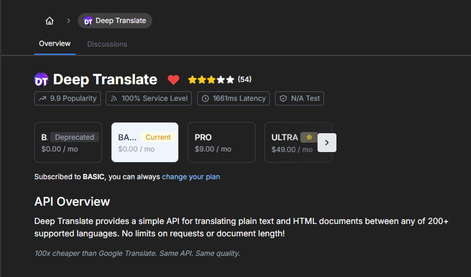

# **Next-i18n-auth**
## **Automation scripts Documentation**
## **Overview**

The **Next-i18n-auth** system is a multi-functional internationalization (i18n) solution designed to streamline the process of handling translations in a large-scale Next.js project. The system is capable of managing language resources, dynamic translation generation, and integration with an API to fetch missing translations on-demand. It also incorporates a Gulp-based build process for generating types, namespaces, and template translations, offering a smooth development workflow.

---

## **Key Features**

### 1. **Automatic Namespace and Key Generation**

* The system automatically generates namespaces and translation keys by scanning the source code. This makes it easy to maintain and scale the application without manually defining each translation key.

### 2. **Translation File Management**

* **Translation Files**: Stores translations for each language in JSON files (e.g., `src/i18n/locales/{language}/{namespace}.json`).
* **Automatic Merging**: New translation keys are automatically merged with existing ones, preserving the previously added translations. Optionally, unused keys can be deleted based on configuration.

### 3. **Dynamic Translation Generation**


* Missing translations are detected and fetched using the **[Deep Translate API](https://rapidapi.com/gatzuma/api/deep-translate1)** from **[RapidAPI](https://rapidapi.com/)**. This ensures that even new translations are automatically populated without manual intervention.


### 4. **TypeScript Integration**

* The system integrates TypeScript to provide type safety for translations. The generated types are used to prevent errors and ensure that only valid keys are used in the codebase.

---

## **Available Gulp Tasks**

### 1. **`gulp` (default task)**

* Runs the following tasks in sequence:

   * `generate-namespaces`: Scans your codebase and generates namespace definitions.
   * `generate-templates`: Extracts translation keys and updates the translation files.
   * `generate-types`: Generates TypeScript types for translations.

### 2. **`gulp generate-namespaces`**

* Scans your codebase for translation keys and generates namespace definitions.
* **Output**: `src/i18n/generated/namespaces.ts`

### 3. **`gulp generate-templates`**

* Extracts translation keys from your source files and creates/updates translation files for all languages.
* **Output**: `src/i18n/locales/{{lng}}/{{ns}}.json`
* **Features**:

   * Avoids data loss by preserving old translations.
   * Allows you to keep old translations even when adding new ones.

### 4. **`gulp generate-types`**

* Generates TypeScript types for your translations.
* **Output**: `src/i18n/generated/types.d.ts`

### 5. **`gulp generate-translations [-l, --lang <language>]`**

* Translates only the missing keys using the Deep Translate API from RapidAPI.
* **Parameters**:

   * `-l, --lang`: language to translate. (Default: all).
* Example:

   * `gulp generate-translations -l kk` - Translates only the Kazakh language.

### 6. **`gulp watch`**

* Automatically runs the following tasks when source files or translation files change:

   * `generate-namespaces`
   * `generate-templates`
   * `generate-types`
* Watches for changes in:

   * Source files (e.g., JSX/TSX files in the codebase).
   * Translation files in `src/i18n/locales`.

### 7. **`gulp create-feature [-n, --name <feature-name>] [--js]`**

* Generates boilerplate for a new feature in your application.
* **Parameters**:

   * `-n, --name`: The name of the new feature (in camelCase or kebab-case). [required]
   * `--js`: Optionally generate JavaScript/JSX files instead of TypeScript/TSX. (Default: false)
* Example:

   * `gulp create-feature -n my-feature` - Generates a new feature with TypeScript/TSX files.
   * `gulp create-feature -n my-feature --js` - Generates the feature with JavaScript/JSX files.

### 8. **`gulp help`**

* Displays the available tasks and their descriptions.

---

## **Workflow**

1. **Namespace Generation**: Run `gulp generate-namespaces` to scan your codebase and update namespace definitions.
2. **Key Extraction**: Run `gulp generate-templates` to extract new translation keys from your codebase.
3. **Type Generation**: Run `gulp generate-types` to generate TypeScript types for the translations.
4. **Translation**: Run `gulp generate-translations` to automatically translate missing keys.
5. **Watching**: Use `gulp watch` to monitor file changes and regenerate namespaces, templates, and types automatically.
6. **Feature Creation**: Use `gulp create-feature` to create a new feature with the necessary boilerplate.

---

## **Configuration**

* **i18next.config.json**:
  This configuration file defines paths, patterns, and options for the translation process. You can edit it to customize your paths, include/exclude patterns, and whether unused keys should be kept.

Example `i18next.config.json`:

```json
{
  // config file in your project.
  "configFilePath": "src/i18n/lib/config.ts",
  // location where all translation files are.
  "localesDirectory": "src/i18n/locales",
  // namespaces for whole project.
  "generatedNamespacesPath": "src/i18n/generated/namespaces.ts",
  // types for all translations.
  "generatedTypesPath": "src/i18n/generated/types.d.ts",
  // if true, old keys are preserved on translation file updates.
  // if false, old keys are removed on translation file updates.
  "keepUnusedKeys": true,
  // parser looks for these files.
  "includePatterns": [ 
    "src/app/**/*.{jsx,tsx}",
    "src/core/components/**/*.{js,jsx,ts,tsx}",
    "src/core/hooks/**/*.{js,jsx,ts,tsx}",
    "src/shared/components/**/*.{js,jsx,ts,tsx}",
    "src/shared/hooks/**/*.{js,jsx,ts,tsx}",
    "src/shared/services/api.{js,ts}",
    "src/features/*/components/**/*.{js,jsx,ts,tsx}",
    "src/features/*/hooks/**/*.{js,jsx,ts,tsx}",
    "src/features/*/lib/zod.{js,ts}"
  ],
  // parser skips these files.
  "excludePatterns": [
    "src/**/*.d.ts",
    "**/node_modules/**",
    "src/i18n/**",
    "src/app/api/**",
    "src/shared/components/ui/**",
    "src/shared/hooks/**",
    "src/shared/data/**"
  ]
}
```

---

## **Conclusion**

The **Next-i18n-auth** system provides a robust and automated way to handle translations, ensuring that your application remains scalable and easy to maintain as it grows. The use of Gulp tasks for namespace and key generation, translation updates, and type safety ensures that your i18n workflow is smooth and efficient.
