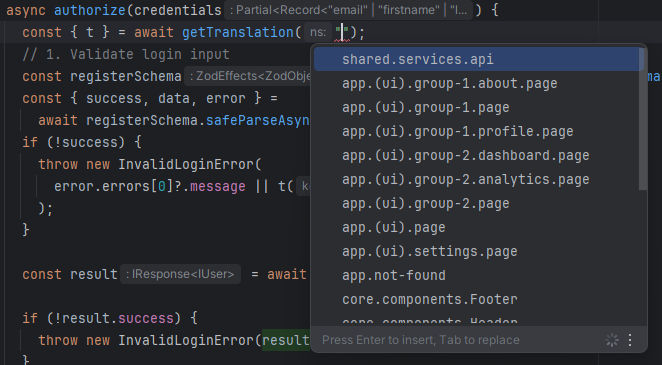

## **Strictly Typed Translation Functions (`useTranslation` and `getTranslation`)**

### **Overview**

In the **Next-i18n-auth** system, we’ve replaced the `useTranslation` hook from `react-i18next` with a custom version that provides **strict typing**. This custom `useTranslation` (and `getTranslation` for server-side code) offers **autocompletion** for namespaces and translation keys directly in your IDE, improving the development experience and ensuring that you are using valid keys and namespaces.

### **How It Works**

* **Strictly Typed Translation Functions**: Both `useTranslation` (for client-side components) and `getTranslation` (for server-side code) are **strictly typed wrappers** around i18next's core translation functions. This means that when you access translation keys, the IDE will suggest the available namespaces and translation keys, ensuring you don’t make mistakes while referencing them.

* **Autocompletion for Translation Keys and Namespaces**: When you use the `t()` function inside `useTranslation` or `getTranslation`, your IDE will offer autocompletion for namespaces and translation keys. This reduces the chance of runtime errors due to missing or incorrect keys.

> ⚙️ **Tip**: Types are automatically generated from your translation templates during the `smart-i18n generate-types` step. See the [Automation Docs](./automation.md) for details.

---


Example usage in **React**:

```tsx
import { useTranslation } from "@/i18n";

const MyComponent = () => {
  const { t } = useTranslation("app.(ui).page");
  // The namespace passed here must match one from your generated `namespaces.ts` file.

  return <h1>{t("Welcome, {{username}}", { username: "John" })}</h1>;
};
```

* The IDE will suggest available namespaces like `features.authentication.components.LoginDialog`, `features.authentication.components.RegisterDialog`, etc.
> 
* When typing `t("`, the available keys within the `features.authentication.components.RegisterDialog` namespace will be suggested automatically.
> 


---

Example usage in **server-side code**:

```ts
import { getTranslation } from "@/i18n";

const { t } = await getTranslation("shared.services.api");

const errorMessage = t("ERR_NETWORK");

```

* The IDE will suggest available namespaces like `shared.services.api`, `app.(ui).group-1.about.page`, etc.
> 

* When typing `t("`, the available keys within the `shared.services.api` namespace will be suggested automatically.
> 


### **Advantages**

* **Enhanced Developer Experience**: With autocompletion, you don’t have to memorize the exact translation keys or namespaces. The IDE takes care of suggesting the correct options as you type.
* **Strict Type Safety**: By defining the translation functions with **strict types**, you ensure that only valid namespaces and keys are used in the application, preventing runtime issues caused by typos or missing translations.
* **Consistency Across the Project**: The strictly typed functions ensure consistency in how translation keys are used across both client-side and server-side code.

---

## 📚 Related Projects

* [`@sayyyat/smart-i18n`](https://www.npmjs.com/package/@sayyyat/smart-i18n) — The core CLI engine that provides scanning, merging, and type generation.
* [`@sayyyat/smart-i18n-react`](https://www.npmjs.com/package/@sayyyat/smart-i18n-react) — Feature-scaffolding CLI tool that integrates smart-i18n into React/Next.js projects with zero configs.
